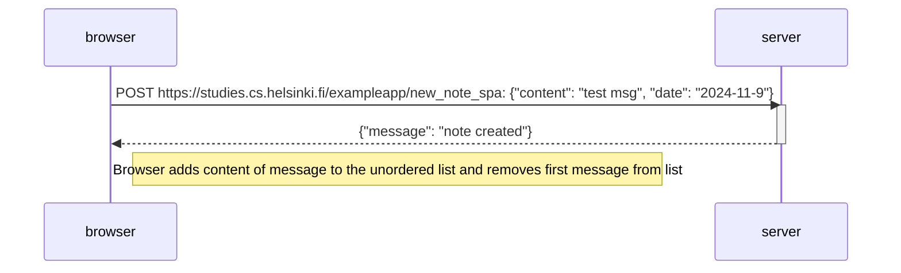

```mermaid
sequenceDiagram
    participant browser
    participant server

    browser->>server: POST https://studies.cs.helsinki.fi/exampleapp/new_note_spa: {"content": "test msg", "date": "2024-11-9"}
    activate server
    server-->>browser: {"message": "note created"}
    deactivate server

    Note right of browser: Browser adds content of message to the unordered list and removes first message from list
```